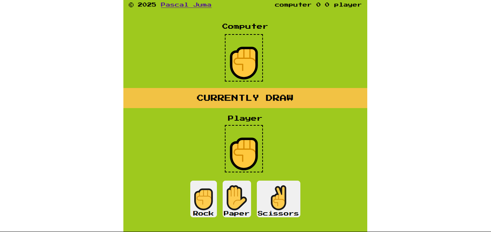

# 🎮 Rock Paper Scissors Game



A simple **Rock Paper Scissors** game built with **HTML, CSS, and JavaScript**. Play against the computer in a fun and interactive way.

## 🚀 Features
✅ **Responsive Design** – Works on desktop & mobile  
✅ **Randomized AI Moves** – The computer picks moves dynamically  
✅ **Score Tracking** – Keeps track of wins, losses, and draws  
✅ **Interactive UI** – Smooth animations and clean design  

## 🎨 **Displaying the Computer's Choice**

To visually represent the computer’s move, we use the following **HTML snippet**:

```html
<div class="player-identity">
    <h1 class="player-computer">Computer</h1>
</div>
<div class="player-emoji">
    <span class="computerChoice">
        ✊
    </span>
</div>
```
 How This Works
 
`<div class="player-identity">` – Creates a labeled section for the computer player.

`<h1 class="player-computer">`Computer</h1> – Displays "Computer" as a heading to indicate the opponent.

`<div class="player-emoji">` – Wraps the emoji representing the computer’s move.

`<span class="computerChoice">` ✊ </span> – Dynamically updates to show the computer’s randomly selected choice `( ✊,  ✋, or ✌`).


---

## 🖥️ **How Player Selection Works in JavaScript**
When the player selects **Rock, Paper, or Scissors**, the UI updates to reflect their choice dynamically. Below is the JavaScript code handling this logic:

```js
choices.forEach((choice, index) => {
    choice.addEventListener("click", (e) => {
        choice.classList.add("active"); // Highlights the selected choice

        // Remove active class from all other choices
        choices.forEach((choice2, index2) => {
            if (index !== index2) choice2.classList.remove("active");
        });

        // Link player choice with displayed emoji
        let emoji = e.currentTarget.querySelector(".emojis").textContent;
        humanChoice.textContent = emoji; // Updates the UI with the selected choice
    });
});
```
 How This Works
 
1 Loop Through Choices:

Iterates over all the available choices (Rock, Paper, Scissors).

Listens for a click event on each choice.

2 Highlight the Selected Choice:

Adds an `"active"` class to the clicked button, visually marking it as selected.

3 Remove Active Class from Other Choices:

Ensures only one choice is highlighted at a time.

4 Extract & Display the Player’s Choice:

Retrieves the selected emoji from the clicked element.

Updates humanChoice.textContent, displaying the player’s selection in the UI.

## 🎥 Demo
🔗 **Live Preview:** [Your GitHub Pages or Vercel Link Here](https://your-live-game-link.com)
